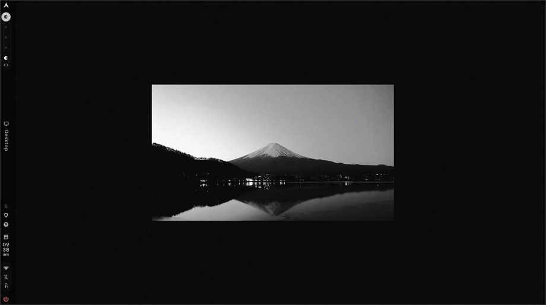
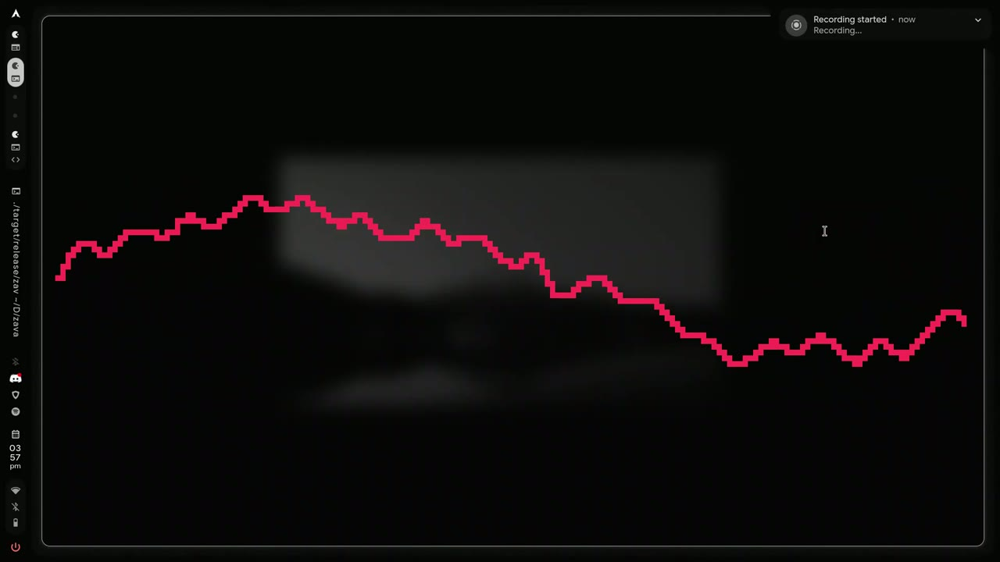
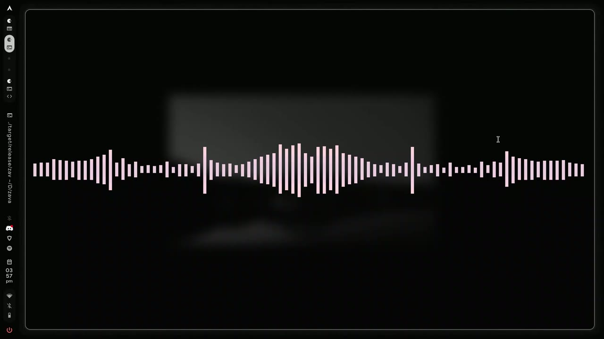
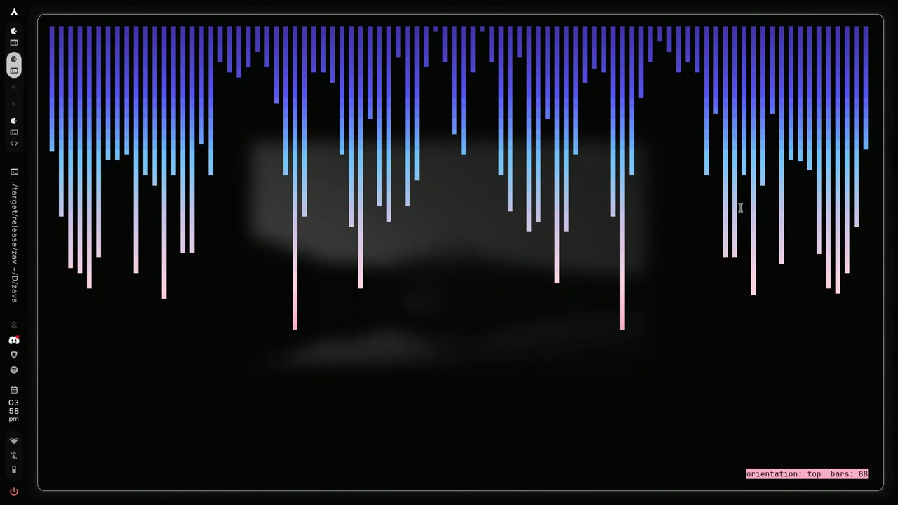
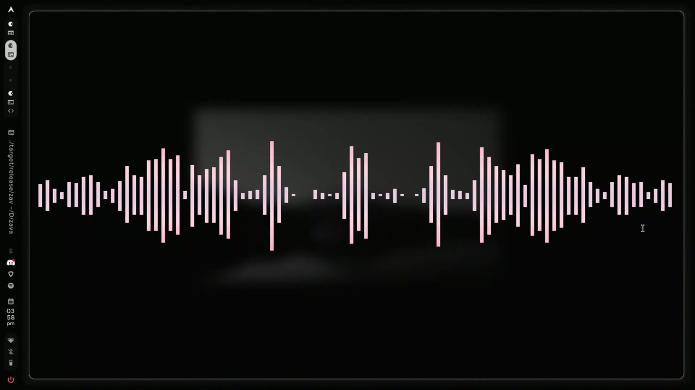
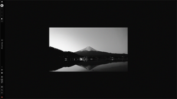
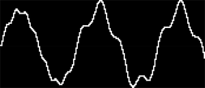
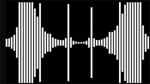

# Zava

**A console-based audio visualizer written in pure Rust, in the spirit of [CAVA](https://github.com/karlstav/cava).**

<p align="center">
  
</p>

CAVA has been putting dancing bars in terminals for over a decade. Zava is my
Rust take on the same idea: the same DSP shape and config style, the same eight
block glyphs, so anyone who used CAVA feels at home. It's not a fork and it's
not a replacement. It's a re-imagining, plus a few extras CAVA never got
around to.

If you already run CAVA, this is easy to like. If you never have, you don't need
to know anything about it to use Zava.

---

## Quick Start

```bash
git clone https://github.com/zakisserious/zava
cd zava
make install          # installs `zava` to /usr/local/bin
zava                  # …that's it. It runs with ZERO configuration.
```

Done. PipeWire is auto-detected, the default sink monitor is captured, bars
appear, and the beat responds. No config file required.

To remove it completely:

```bash
make uninstall        # removes the binary, man page, and reference config
```

No-root alternative: `make install PREFIX=~/.local` (needs `~/.local/bin` on
your `PATH`). The repo also carries an Arch `PKGBUILD`, see
[Installing](#installing).

Watching it live beats reading about it. A 38-second capture of a small test
track, retimed slightly for clarity:

<video controls src="docs/media/zava-demo.mp4"></video>

| 1 s | 12 s | 24 s | 36 s |
|-----|------|------|------|
|  |  |  |  |

---

## The 16-Visual Upgrade Pack

The core still behaves like CAVA: gradient bars, smoothing, gravity. On top of
that, the renderer has sixteen extra tricks, every one toggleable live from the
in-terminal menu (press `m`):

| # | Visual | What it does | Config |
|---|--------|--------------|--------|
| 1 | **Bar reflection** | A dim, mirrored strip underneath the bars (bottom orientation) | `bar_reflection` |
| 2 | **Bright peaks** | Bars above the bright threshold use accent ink instead of the gradient | `bright_peaks` |
| 3 | **Bar caps** | A solid cap on the top cell of each bar, so bar tops stay readable | `bar_cap` |
| 4 | **Beat pulse** | A fast, full-frame brightness flash on real bass hits | `beat_pulse` |
| 5 | **Waveform oscilloscope** | A line oscilloscope of the waveform instead of bars | `waveform` + `waveform_style = line\|filled\|area` |
| 6 | **Waveform baseline** | A guide line under the oscilloscope trace | `waveform_baseline` |
| 7 | **Waveform graticule** | Horizontal measure lines across the waveform area | `waveform_graticule` |
| 8 | **Waveform dynamics** | Bass-reactive gain so the trace ducks with the kick | `waveform_dynamics` |
| 9 | **Bar baseline rule** | A ruler-style scale line along the bottom of the bar block | `baseline_ruler` |
| 10 | **Stereo divider** | A vertical pulse line between the two stereo halves | `stereo_divider` |
| 11 | **ASCII fallback** | Pure-ASCII bar rendering (8-level `#` packing) when block glyphs are unavailable | `ascii_glyphs` |
| 12 | **Background gradient** | A per-row color ramp behind the bars instead of one flat fill | `background_gradient` |
| 13 | **Spectrum mode** | Color sweeps across the meter by frequency | `spectrum` |
| 14 | **Accent ink** | Peaks and caps borrow your theme's accent color in every orientation | `color.theme` |
| 15 | **Reduced motion** | Turns off per-frame brightness oscillation and pulse flashes | `reduce_motion` |
| 16 | **Orientation parity** | Glyph support for `left` / `right` / `horizontal` / `top`, not just bottom | — |

Each one is a `0`/`1` flag or a small value in `~/.config/zava/config`. Everything
defaults to off or conservative; you opt in.

> ⚠️ Fake screenshots would be lame, so these are real captures of the live
> `--test` mode. Run `zava --test` with zero playback to see it all immediately:

| Bars (bottom) | Waveform | Mirror (horizontal) |
|---|---|---|
|  |  |  |

---

## Key Controls

| Key | Action |
|-----|--------|
| <kbd>Up</kbd> / <kbd>Down</kbd> | Increase / decrease sensitivity (±15%) |
| <kbd>Left</kbd> / <kbd>Right</kbd> | Decrease / increase bar count (auto-width aware) |
| <kbd>o</kbd> | Cycle orientation: `bottom → top → left → right → horizontal` |
| <kbd>f</kbd> / <kbd>b</kbd> | Cycle foreground / background color |
| <kbd>m</kbd> | Open the interactive settings menu (Esc/<kbd>q</kbd> to exit) |
| <kbd>r</kbd> | Reload full config live |
| <kbd>c</kbd> | Reload color / theme only |
| <kbd>q</kbd> / <kbd>Esc</kbd> / <kbd>Ctrl+C</kbd> | Quit (cleanly restores the terminal) |

### Unix signals

- `SIGUSR1` — full config reload (like <kbd>r</kbd>)
- `SIGUSR2` — color/theme reload only (like <kbd>c</kbd>)
- `SIGWINCH` — automatic terminal resize handling

```bash
pkill -USR1 zava   # reload config on all running instances
```

---

## Why it exists

Some projects make you think "someone should write this in Rust," and then
nobody does, so you have to. This is that project.

The DSP is a faithful port, not a loose reinterpretation: dual-buffer SIMD FFT,
Hann windowing, the barycentric-to-logarithmic cutoff distribution, Monstercat
smoothing, gravity physics. The test suite is ported from CAVA's own
`cavacore_test.c` and checks frequency-peak bin accuracy plus smoothing output
within `<0.5%` error, so it measures up rather than just feeling close.

The glyphs are the same eight CAVA blocks (`▁▂▃▄▅▆▇█`), drawn with terminal
synchronized updates and 24-bit TrueColor gradients, so there's no flicker.

On the audio side: PulseAudio/PipeWire capture, CPAL fallback, FIFO input for
players like MPD, and a built-in test signal for when you want a moving meter
with no sound at all.

Config lives at `~/.config/zava/config` and Zava never touches `cava/config`.
You can run both side by side. It warns if it spots a cava config, then leaves
it alone.

---

## Installing

### From this repo (fastest)

```bash
make install
make install PREFIX=~/.local      # user-local, no root
make uninstall                     # full removal
```

Installation places the binary in `PREFIX/bin`, the man page, and a reference
config at `PREFIX/share/zava/config.example`.

### Arch Linux (PKGBUILD)

```bash
make dist && makepkg -si
```

### Via cargo

```bash
cargo install --path .
```

> Note: `cargo install --path .` has no clean uninstall. Use the Makefile
> (`make uninstall`) to remove the binary.

### Prerequisites

- Rust 1.70+ (`rustc`, `cargo`)
- Audio stack: PipeWire or PulseAudio
- Dev headers for the capture backends:

```bash
# Debian / Ubuntu / Mint
sudo apt-get install build-essential libpulse-dev libasound2-dev

# Arch Linux
sudo pacman -S base-devel libpulse alsa-lib

# Fedora
sudo dnf install pulseaudio-libs-devel alsa-lib-devel
```

macOS and Windows have no `parec`, so the capture backend is CPAL (disabled by
default because it pulls in more crates). Build with the `cpal` feature:

```bash
# macOS — same command as Linux
make install FEATURES=cpal
zava --method cpal          # capture from the default input/loopback device

# Windows — install MSVC toolchain + make (MSYS2, or winget install GNU.Make)
make install FEATURES=cpal
zava --method cpal
```

macOS: run in iTerm2 for full 24-bit color (Terminal.app doesn't set
`COLORTERM=truecolor`). Windows: run in Windows Terminal; `SIGUSR1/2` don't
exist there, so use the `r` / `c` keys, which work everywhere.

---

## Usage

```bash
zava                     # run with ~/.config/zava/config (auto-created defaults)
zava --test              # built-in test music, no sound output needed
zava -p /path/to/config  # custom config file
zava --method fifo --source /tmp/mpd.fifo   # external player integration
zava --output raw        # binary/ascii data stream (Waybar, Polybar, scripts)
zava --generate-config   # write a config sample to ~/.config/zava/config and exit
```

| Flag | Description |
|------|-------------|
| `-p, --config <path>` | Custom config path |
| `--test` | Internal harmonic test audio |
| `--generate-config` | Write config and exit (`--force` to overwrite) |
| `--method <m>` | `pipewire`, `pulse`, `alsa`, `fifo`, `cpal`, `test` |
| `--source <dev>` | Device / monitor source |
| `--output <m>` | `noncurses`, `ncurses`, or `raw` |
| `--channels <m>` | `stereo` or `mono` |
| `-v, --version` / `-h, --help` | Version / help |

---

## Configuration

Zava reads a CAVA-style INI from `$XDG_CONFIG_HOME/zava/config` or
`~/.config/zava/config`. Lookup order: explicit `-p` path, then XDG, then home.
Every option has a sensible default, so running with zero config really works;
the file only exists if you want to tune.

A fully commented template ships at `share/zava/config.example` and can be
generated with `zava --generate-config`. The headline sections:

```ini
[general]
framerate = 60
autosens = 1
sensitivity = 100
bars = 0                    # 0 = auto-fit to terminal width
bar_width = 2
bar_spacing = 1
lower_cutoff_freq = 50
higher_cutoff_freq = 10000

[input]
method = pipewire           # pipewire | pulse | alsa | fifo | cpal | test

[output]
orientation = bottom        # bottom | top | left | right | horizontal
channels = 2                # stereo draws TWO mirrored halves
waveform = false            # oscilloscope instead of bars
waveform_style = line       # line | filled | area
stereo_divider = false      # visual divider between stereo halves
xaxis = none

[color]
gradient = false
gradient_count = 8
gradient_color_1 = '#ff5555'
gradient_color_8 = '#f1fa8c'
foreground = '#ffffff'
background = '#000000'
spectrum = false            # hue-sweep spectrum coloring
background_gradient = false # per-row background ramp

[smoothing]
monstercat = 0              # float > 0 = inter-bar smoothing (try 1.5-3.0)
noise_reduction = 77
gravity = 100

[eq]
# per-band LINEAR multipliers (CAVA semantics: 0.8 = -20%, 1.2 = +20%)
1 = 0.8
2 = 0.9
3 = 1.0
4 = 1.1
5 = 1.2
```

All the visual upgrades live under `[output]` and `[color]` (see the table
above), each a `0`/`1` toggle you can also flip from the `m` menu.

> **Tip:** with `bar_spacing = 0`, bars touch and the 1/8-row quantization shows
> as a pixel staircase. Raising `monstercat` (e.g. `2.0`) bleeds each bar's peak
> into its neighbours and turns the staircase into a smooth curve.

---

## Testing

```bash
cargo test
```

68 tests across the DSP, config, and renderer suites:

- **DSP** (`tests/dsp_test.rs`) — ported from CAVA's official simulation test,
  covering frequency-peak bin accuracy, integral smoothing, and Monstercat
  calculations within `<0.5%`.
- **Config** (`tests/config_test.rs`) — full INI parsing, gradients, equalizer
  curves, and fallback defaults.
- **Renderer** — waveform envelope band wrapping, divider layout, and color math.

---

## Troubleshooting

| Symptom | Fix |
|---------|-----|
| Bars don't move | Audio must actually be playing; on PipeWire the monitor suspends in silence. Zava captures the active default sink `.monitor` via `pactl`. |
| Audio lags | Tighten the buffer: Zava requests low 20 ms latency; check your PipeWire buffer settings. |
| Stale glyphs after resize | Press <kbd>r</kbd>; Zava also clears the frame on every layout recomputation. |
| Weird glyphs in plain text terminals | Enable `ascii_glyphs = 1` and, for truly 8-bit terminals, use `data_format` raw output. |

---

## License

MIT, see [LICENSE](LICENSE).

Thanks to Karl Stavestrand and everyone who kept CAVA running for over a decade.
Zava builds on your work. ✊🕶️